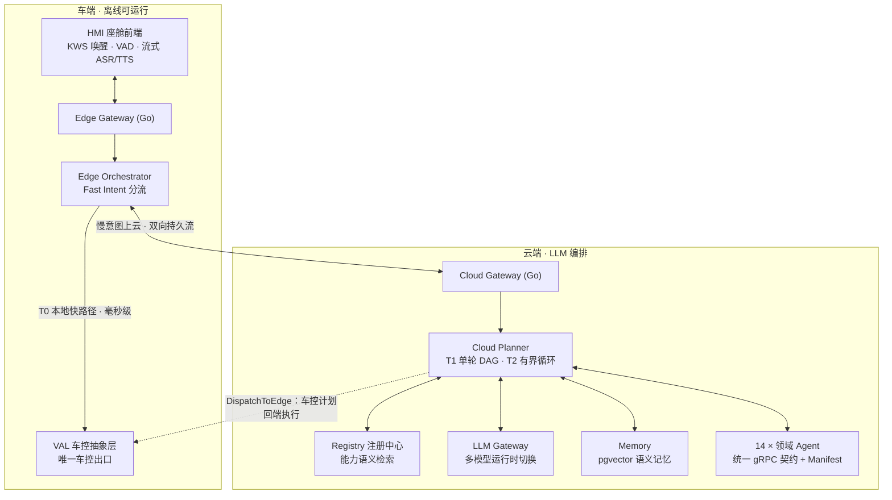

# Flashpit Agent：端云协同的座舱 Multi-Agent 系统


[](LICENSE)

Flashpit 是一套把「语音助手」做成**可执行系统**的参考实现：一句话进来，系统先判断它属于
「车端立刻能闭环的高频指令」还是「需要多步编排的复杂意图」，再分别交给端侧确定性链路与
云端 LLM Planner。模型在系统里只承担理解与规划；凡是触碰车辆的部分，**计划由模型产出、
执行由确定性代码完成**——车控指令没有任何一条路径由 LLM 直接下发。

- 规模速览：**14 个领域 Agent · 30 个微服务一键起栈 · 68 个车控/媒体对象**
- 数据源全真实：高德 / 和风 / Exa / Tushare / api-football，演示可降级、不造假
- Agent 间统一 gRPC 契约，经注册中心动态发现；新增 Agent 不改编排核心代码
- 高频车控请求在车端毫秒级闭环，弱网/断网可用；复杂意图上云并行编排

---

## 目录

1. [系统设计底线](#1-系统设计底线)
2. [运行拓扑与请求分级](#2-运行拓扑与请求分级)
3. [端侧：语音链路与车控](#3-端侧语音链路与车控)
4. [云侧：Planner 与领域 Agent](#4-云侧planner-与领域-agent)
5. [记忆、模型运行时与可观测](#5-记忆模型运行时与可观测)
6. [交互示例：一句话背后的执行链](#6-交互示例一句话背后的执行链)
7. [界面](#7-界面)
8. [本地起栈](#8-本地起栈)
9. [仓库布局](#9-仓库布局)
10. [现状、边界与量产路径](#10-现状边界与量产路径)
11. [许可](#11-许可)

---

## 1. 系统设计底线

四条约法式约束。每一条都不是口头原则，而是有测试或架构强制的硬约束。

**① 规划与执行分离（车控出口唯一化）**
LLM 只产出意图与计划，最终动作由确定性 Executor 执行。车辆控制只有一个出口——VAL
（Vehicle Abstraction Layer），它做权限校验、危险动作二次确认与场景限制。任何组件
（包括 Agent 与模型本身）都不得绕过 VAL 直接触碰 CAN/SOME-IP 或下发控制帧。
关键凭据只进 `.env`，敏感数据（精确位置、车内音视频、支付）默认不出车，
上云时按 manifest 的 `context_scopes` 做最小化下发。

**② 快慢双系统（时延与可用性是架构属性）**
请求按「是否高频、是否确定、是否安全敏感」分成快慢两路：高频且确定的指令（车控、媒体）
留在车端本地执行，毫秒级返回、离线可用；复杂、跨域、多轮的需求上云，由 Planner 编排
多个 Agent 协作完成。两条路共享同一套语义理解入口，对用户表现为一个对话。

**③ 声明式接入（编排核心对具体 Agent 零硬编码）**
每个 Agent 携带 manifest：声明能力、权限、确定性路由兜底（`route_hints`）、执行后对账
要求（`verification`）与卡片优先级。接入注册中心即被发现。相应地，跨领域组合判据以
声明式知识文件（`skills/`）供给 Planner——投一个文件即生效，不改编排代码。

**④ 真实数据优先（演示可以降级，不能造假）**
导航/天气/搜索/新闻/赛事/股票全部接真实 Provider；外源数据卡片带 `_prov` 溯源标记
（数据真实性 / 来源 / 取数时间）。运行期真实源失败时**诚实降级**——明确告诉用户
「拿不到」，绝不静默回退到 mock 假数据把演示坐标当真实位置。

## 2. 运行拓扑与请求分级

### 2.1 总体拓扑

服务间同步调用走 gRPC（`proto/` 是唯一契约源），异步与主动推送走 NATS；
短期状态在 Redis，长期与向量记忆在 PostgreSQL + pgvector。云端编排与车端快路径
通过持久双向流连接。



### 2.2 请求分级：T0 / T1 / T2

一条请求进入系统后，按其复杂度落入三层运行模型之一：

- **T0 · 车端本地快路径** —— 车控、媒体等高频确定性指令。走规则 + 知识库，
  毫秒级闭环，全程不经过模型，离线可用。
- **T1 · 云端单轮 DAG** —— 复杂、跨域或多意图请求。LLM Planner 规划一次，
  确定性引擎并行执行各分支后聚合。
- **T2 · 云端有界 Agentic 循环** —— 需要根据中间结果调整计划的迭代型任务
  （深度调研、动态行程改排）。循环次数与时间预算受控，避免失控空转。

## 3. 端侧：语音链路与车控

### 3.1 全双工语音链路

从唤醒到打断全链路流式，且各引擎均可切换：

- **唤醒**：浏览器本地 KWS（sherpa-onnx WASM），唤醒词「小莱小莱 / 你好小莱…」。
  唤醒前的音频不出浏览器；唤醒后人声应答。
- **听**：silero VAD 端点检测 + DashScope 实时流式 ASR——边说边上屏、停顿定稿后自动发送。
- **说**：服务端流式 TTS（文本增量进、PCM 分片出），cosyvoice / qwen3 / MiMo / MiniMax
  四引擎可切，播报中支持打断（barge-in）。
- **免唤醒连续对话**：续问窗内直接接话；「退下吧」本地退场，不上云。
- **拒识与澄清**：hands-free 场景下非受话语句（如乘客闲聊）静默拒识——不打扰、不落库；
  真歧义句出选择卡确认一次再执行，明确句绝不反问。
- **端到端语音直连（可选挡位）**：闲聊与常识由语音大模型直接听直接答；需要执行或查实时
  信息的请求由模型自动交回确定性链。危险动作的「确认 / 取消」永远由确定性主链裁决。
  默认关闭（该挡位上传播放窗口的原始语音，须用户显式开启）。
- **按声区分乘员（可选挡位）**：唤醒后首句识别说话人，记忆按乘员隔离（OwnerKey 数据面
  隔离）；认不出时一律按主驾处理。声纹只用于区分记忆，不作为权限或支付凭证。
- **看一看（可选挡位）**：说「那是什么 / 这是什么车」时抓一帧画面交多模态模型识别；
  只在说这类话时抓帧，图像只在网关内存存活两分钟，不落盘、不进对话链。

### 3.2 车控与混合多意图

端侧知识库驱动 68 个车控/媒体对象的归一化、校验、安全门控与话术（空调 / 座椅 / 车窗 /
氛围灯 / 360 环视 / 蓝牙 / 广播…）。混合多意图按语义组分流：同一请求内的本地动作与云端
慢意图并行推进——「打开空调，放首林俊杰，导航去公司」被拆为本地车控/媒体立即执行 +
导航意图上云，再合并呈现结果。

## 4. 云侧：Planner 与领域 Agent

### 4.1 规划执行链

Cloud Planner 把用户意图编译为一次可执行计划：T1 的单轮 DAG 各分支并行下发、
T2 任务在受控预算内自适应再规划。规划知识按需供给——多日行程、导航顺路、条件依赖、
充电分流这类组合判据以声明式文件（`skills/guides`、`skills/policies`）注入，
经词法 + 语义双通道检索。落域质量靠数据增长而非人写正则：正确落域范例投进
`skills/exemplars/` 后作 few-shot 影响判断；确定性 `route_hints` 在模型之后硬改写
计划兜底，防止模型把已判对的结果踩掉。

### 4.2 领域 Agent 编队

14 个 Agent 按能力域分组如下（均实现统一 gRPC 契约，可独立增删）：

| 域 | Agent | 一句话能力 |
|---|---|---|
| **出行** | `navigation` | 高德导航：POI 检索、视觉地标与俗称解析、途经点、到达时限 ETA、**进行中路线增量改道** |
| | `trip-planner` | 结构化多日行程：真实 POI 接地、电量感知充电编织、多城市保序、局部改排不漂移 |
| | `charging-planner` | 沿途 / 目的地充电规划与候选二次确认 |
| | `nearby` | 周边发现（高德 POI 2.0）：餐饮 / 酒店 / 景点 / 停车 / 充电，价位与营业状态筛选 |
| **信息** | `info` | 天气（和风）/ 搜索（Exa：强制引用、无据弃权）/ 新闻 / 股票（Tushare）/ 赛事 |
| | `deep-research` | 有界并行检索 + 带引用的分节报告，异步分钟级深调研，完成后主动推送 |
| | `manual-rag` | 车型车主手册问答：整本图文索引绑定私有 `.mrag` 包，错车型 / 低相关 fail-closed |
| | `vision` | 「那是什么」：单帧画面交多模态识别，图像不落盘 |
| **日程与事务** | `reminder` | 自然语言提醒 / 待办：改期、snooze、重复规则、按 ETA 反算时刻、跨域交接 |
| | `scene-orchestrator` | 一句话创建自定义场景；激活执行零 LLM；退出恢复到激活前状态 |
| | `road-safety` | 路况安全与响应式主动播报 |
| | `parking-payment` | 停车缴费：查费只读，缴费经统一支付网关出付款码（Agent 不持支付凭证） |
| **个人与生态** | `chitchat` | 闲聊与常识直答（墙钟 / 日期按系统时钟确定性直答，不让模型编时刻） |
| | `mcp-bridge` | 受控 MCP 生态桥：人工准入 + 版本锁定 + schema 指纹；写操作有确认闸、请求幂等 |
| | | （已接入麦当劳 / 瑞幸官方 MCP：选店 → 预览计价 → 创建订单 → 安全支付入口 → 查单） |

回答模式按判据路由，一句话精确落到**直答 / 联网查询 / 新闻 / 深度调研**之一；
Agent 误接时经 `_escalate` 自动改派，不给用户念错卡片。

## 5. 记忆、模型运行时与可观测

### 5.1 记忆与个性化

- **语义记忆**（pgvector）：自动从对话抽取偏好与个人实体（常用地点、口味、家人关系），
  语义召回注入规划与闲聊；隐私分级，可查可删。
- **上下文装配**：在统一 token 预算内装配能力目录（语义预筛）+ 对话历史 + 长期记忆 +
  结构化焦点态。跨轮指代（「第二家」「刚才那家」）不靠重读原文——候选集与执行事实是
  焦点态的一等成员；敏感上下文按 manifest 最小化下发。
- **主动消息治理**：七路主动（routine / 场景触发 / 路况播报 / 提醒到点 / 深调研完成 /
  晨间早报 / 低电量顺路建议）统一过主动引擎：投递时刻复核情境断言、跨生产方去重、
  驾驶负荷高时延后、同窗消息合并，再经 NATS 送达 HMI。

### 5.2 模型与语音引擎运行时

进程内维护多厂商注册表（MiMo / MiniMax / DeepSeek / 通义千问），HMI 设置页运行时热切换
并持久化；每个业务帧携带请求级 provider/model pin，429 与流式故障分类降级、
跨厂商备份档兜底，embedding 与 chat 厂商解耦。ASR 走 DashScope 实时流式（qwen3 / fun
双协议）；TTS 四引擎 +「引擎 → 音色」两级选择。评测报告锁定 provider，避免跨模型漂移
造成不可信的对比。

### 5.3 可观测与 badcase 闭环

`trace_id` 从 HMI 气泡角标一键复制，贯通到每一跳 LLM 调用（tokens / 时延 / 门控内容），
collector 以 SQLite 持久化。Dashboard 提供会话三级下钻、总览、日志与 badcase 收藏
一键重放对照四视图；Prometheus `/metrics` 与 OTel span 导出经 `--profile observability`
可选启用。问题修复闭环：真机反馈 → trace 下钻定位 → 修复 → 原句真栈复验。

## 6. 交互示例：一句话背后的执行链

以下为真栈实测的对话形态（数据均来自真实 Provider），右侧列出每条背后实际发生的事：

| 对话 | 系统实际执行 |
|---|---|
| 「空调调到 22 度」 | T0 车端快路径：Fast Intent 识别 → VAL 权限校验 → 下发，零 LLM、毫秒级、断网可用 |
| 「接女儿放学，顺路买杯咖啡，五点前到学校」 | 关系图谱解析「女儿」的学校 → 沿途咖啡候选逐家 ETA → 到达时限判定，单轮完成 |
| 「咖啡不买了，先去加油站，别迟到」 | 对进行中导航**增量改道**：删途经点、就近插加油站，目的地与时限不变 |
| 「老婆爱吃粤菜」→ 数天后「晚上找地方吃饭」 | 长期记忆改变的是**结果集**：直接召回粤菜馆，而不是一句「已参考您的口味」 |
| 「打开空调，放首林俊杰，导航去公司」 | 混合多意图按语义组分流：车控 / 媒体本地立即执行，导航意图上云，协同完成 |
| 「导航去那个像春笋的大楼」 | 视觉地标描述 → LLM 解析官方名 → 高德真实 POI 校验后导航 |
| 「周末去杭州玩两天，帮我规划」 | LLM 出骨架 → 确定性流水线接地真实 POI → 沿路线按真实电量编织充电站 → 校验每日车程 |
| 「创建钓鱼模式」 | 一句话造场景：模型只在创建期编译（过 VAL 白名单）；激活 / 执行零 LLM，退出自动恢复 |
| 「到公司前提醒我交周报」 | 按导航 ETA 反算提醒时刻，成单后到点主动触达 |
| 「明天第一场比赛提醒我」 | 赛事 Agent 与提醒 Agent 跨域交接，开赛前自动提醒 |
| 「调研固态电池量产进展，查完告诉我」 | 秒级受理 → 后台有界多视角迭代检索 → 完成后主动推送带引用的分节报告 |
| 「（看着候选列表）第一家和第二家一共多少钱」 | 候选集是一等会话对象：最值 / 合计 / 序数取值在规划前确定性算出，零 LLM |
| 「为什么选这几家」 | 决策可解释：检索 → 过滤 → 排序全程结构化，追问基于真实轨迹作答，不编造 |

## 7. 界面

HMI「Aurora Glass」：白绿主题、横屏两栏——左侧对话流 + 右侧「上下文舞台」随对话切换
场景，气泡 ↔ 卡片 ↔ 舞台三联动，约 20 类结构化卡片。本地真栈运行截帧：

| 周边发现（一句话检索真实 POI） | 路线规划（多轮指代 + 地图联动） |
|:---:|:---:|
| 说「附近的充电站」，`nearby-agent` 经高德实时检索返回带距离、地址、评分与营业状态的候选列表；可继续「导航去第 2 个」做序数引用 | 承接候选集说「导航去第二个」，`navigation-agent` 解析序数指代 → 取 POI 经纬度 → 高德路线规划 → 右侧地图渲染虚线航路；底部透出 `navigate` 结构化意图供审计 |
|  |  |

## 8. 本地起栈

依赖：Docker Desktop、Go 1.24+、Node 20+；buf 仅在修改 proto 后需要。

```bash
cp .env.example .env         # 空配置即可运行：LLM 与外部数据源自动落到 mock 实现
make proto                   # 生成 gRPC 代码（新 clone 首次 / 改 proto 后必跑）
make up                      # 一键起全栈 30 个服务
```

起栈后访问：

- **HMI 座舱** <http://localhost:5173> —— 点击/按住「小莱」光球说话，或直接打字。
- **可观测台** <http://localhost:5174> —— 会话下钻、trace 查看、LLM 消耗归属。

几个注意点：

- 只能从仓库根 `compose.yaml` 启动（`make up` 已封装）。直接用
  `deploy/docker-compose.yaml` 会丢失根 `.env`，真实 Provider 将静默回退 mock。
- 真实数据源与 LLM 凭证键位见 `.env.example`；Dashboard 的车辆动态调试接口仅限本地
  演示，非开发环境请设 `DEBUG_VEHICLE_CONTROL=false`。

## 9. 仓库布局

```text
proto/            gRPC 接口契约——全仓唯一的接口定义来源
gateway/          Go 网关层（edge 端侧 / cloud 云侧两个接入面）
orchestrator/     edge/ 端侧编排 + FastIntent + VAL 模拟；cloud/ 云端 LLM Planner
agents/           14 个领域 Agent；_sdk/ 公共 SDK（BaseAgent / 检索接地内核 / 任务账本）
skills/           规划知识声明式载体：guides/ 组合判据、policies/ 跨域约束、exemplars/ 落域范例
llm-gateway/      LLM / Embedding / ASR / TTS 多引擎唯一出口
registry/         注册中心：manifest 登记 + 能力语义检索
memory/           记忆与用户画像服务（pgvector 向量库）
security/         权限与 scope 引擎、内容审核、注入防护
payment-gateway/  支付网关（收款凭据由网关持有，Agent 全程不接触）
proactive/        主动消息裁决点——「现在该不该打扰驾驶员」由它定
observability/    事件出口（NATS）、collector、trace 与指标
hmi/              车机前端 React 应用（Aurora Glass 主题）
dashboard/        React 可观测台
runtime/          共享运行时（gRPC keepalive / mTLS / 优雅停机）与端云共用的确定性判定
                  （时区墙钟 / 指令极性 / 中文时间词 / 营业时间 / 安全信号 / 问句形态 / 决策轨迹）
deploy/           docker-compose 编排与证书生成
test/             e2e、冒烟与评测入口
docs/             设计、规划与截图
certs/            mTLS 证书生成物（gitignore）
models/           端侧模型与手册索引（gitignore，目录结构保留）
```

工程相关入口：接手与红线见 `AGENTS.md`；目录规范与安全约定见 `CLAUDE.md`。

## 10. 现状、边界与量产路径

当前为 **Phase 1 工程化 PoC**：T0/T1/T2 运行模型、云端中枢、语音回路、记忆与上下文、
可观测与 14 个领域 Agent 均已落地，`make up` 即可整栈运行。距量产仍有明确边界，
如实列出：

- **VAL 为 Python 模拟**（`orchestrator/edge/val.py`）：真实 SOME-IP/CAN 对接、
  车规资源约束与 OTA 属于量产阶段工作。
- **单实例状态**：Cloud Gateway 的车辆长连状态保存在单实例内存；Registry 已有
  PostgreSQL 持久化与周期重注册自愈，多实例横向扩展待做。
- **安全能力已落地但本地开发档默认关**：两层会话鉴权（`AUTH_REQUIRED`）与服务间 mTLS
  （`GRPC_TLS`）经 env 门控，开启即全栈生效；真实 IdP 与证书轮换属后续。
- **商户闭环为 PoC 账号模型**：麦当劳 / 瑞幸工作流已打通至「创建未支付订单、展示受控
  支付入口、查单」，不代执行最终付款，麦当劳官方工具面无远程取消；多乘员独立商户账号
  与 token 自动刷新尚未产品化。

### 10.1 硬件量产对接（VAL 后端化）

车控要对接真实硬件的本质，是在 VAL 层新增**真实协议后端**——上层 Agent / Planner / HMI
一行不改。这正是「车控只经 VAL」红线的回报：

```text
orchestrator/edge/val/
├── base.py            # ValBackend 抽象基类：send_command(command) -> result
├── mock.py            # 当前 Mock 后端（保留：CI / 离线开发）
├── can_backend.py     # CAN 后端：cantools 加载 DBC → 编码信号 → SocketCAN 发送
└── someip_backend.py  # SOME-IP 后端：服务发现 → Method 调用 → Event 订阅
```

`VAL_BACKEND=mock|can|someip` 决定启用哪个后端，切换不影响任何上层代码。

#### 两条总线技术路线对比

| 维度 | CAN（传统车身网络） | SOME-IP（新一代域控 / 中央计算） |
|---|---|---|
| 通信模型 | 信号导向，广播 | 服务导向，RPC + PubSub |
| 带宽 | 1 Mbps（CAN FD 5–8 Mbps） | 100 Mbps ~ 1 Gbps（车载以太网） |
| 数据定义 | DBC：CAN ID + 字节位 + 缩放 + 偏移 | Fibex / ARXML：服务接口定义 |
| 服务发现 | 无（静态配置） | SD 动态发现 |
| 典型对象 | 座椅 / 空调 / 门窗 ECU | 域控制器 / 座舱 / 智驾域 |
| 实现库 | `python-can` + `cantools` + ISO-TP | `vsomeip` / `someip-py` |
| 诊断 | UDS over ISO-TP | UDS over SOME-IP 或 DoIP |

量产车多为混合架构：座舱域控走 SOME-IP、车身 ECU 走 CAN，中间由中央网关做协议转换。
VAL 适配层可同时支持两种协议，或只对接座舱域 SOME-IP、由域控向下转 CAN。

#### 一条「空调 26 度」指令的 CAN 全流程

1. 语音 / HMI →「打开空调 26 度」；
2. Edge Orchestrator Fast Intent 识别为 `hvac.set(temp=26)`；
3. VAL 权限校验：`commands.yaml` 确认 `hvac.set` 允许 voice 场景、无需二次确认；
4. CAN 后端编码：DBC 查 `HVAC_Control` 帧（如 CAN ID `0x3E2`），`TempSetpoint`
   factor=0.5 → 26° 编码 raw=52，`PowerOn=1`，组装 data；
5. SocketCAN 经 `can0` 发出 `0x3E2` 帧；
6. HVAC ECU 执行后经状态帧（如 `0x3E3`）回传当前温度；
7. VAL 监听 `0x3E3` → 解析 `TempActual` → 返回 Orchestrator → HMI 展示「26 度」。

工程细节提醒：多数车控指令需**周期看门狗**（如每 100 ms 发一次、持续 1 s），否则 ECU
判定指令丢失而回退；超 8 字节数据需 ISO-TP 多帧；UDS 诊断需依次进入扩展会话 →
安全访问解锁 → 例程控制。

#### 总线安全与功能安全

- **权限与确认**：`require_confirm` 是危险动作二次确认的权威来源，由 VAL 强制执行，
  不信任模型层；`drive` / `voice` 场景限制在 VAL 层判定。
- **总线级安全**：UDS 安全访问写入关键参数前需密钥解锁；SecOC 为 CAN 报文加 CMAC 认证码
  防伪造；VAL 持续心跳，ECU 检测丢失进入安全状态。
- **功能安全（ISO 26262）**：按 ASIL 分级（刹车 ASIL D、空调 QM）；VAL 需故障检测与
  安全降级，关键报文加 E2E 计数器与 CRC 防丢帧错帧。
- **审计**：全部车控指令记录 provenance（发起方 / 时间 / 执行结果）经 `obs` 链路持久化。

#### 验证路径

| 阶段 | 内容 |
|---|---|
| 桌面验证 | Mock VAL 验证软件链路（已有） |
| HIL 硬件在环 | PCAN-USB / 周立功适配器 + 真实或模拟 ECU；CANoe 抓包校验报文 |
| 台架验证 | 座舱域控 + 车身域控 + 关键 ECU 组台架；SOME-IP 联调与全场景回归 |
| 实车验证 | 测试车 OBD / 诊断口接 CANoe；边界测试（行驶中 / 低电压 / 高温 / 总线高负载） |
| 标定与量产 | 对齐整车 DBC 版本、OTA 灰度、功能安全认证 |

落地第一步只需要三件事：确认目标车型通信架构 → 获取整车 **DBC / Fibex 文件**（没有信号
定义一切无从谈起）→ 采购 CAN 适配器（PEAK / 周立功），随后实现对应 `*_backend.py`
并用 `candump` / CANoe 验证编码正确性与 ECU 响应。

## 11. 许可

本项目采用 [Apache License 2.0](LICENSE) 开源许可发布。
