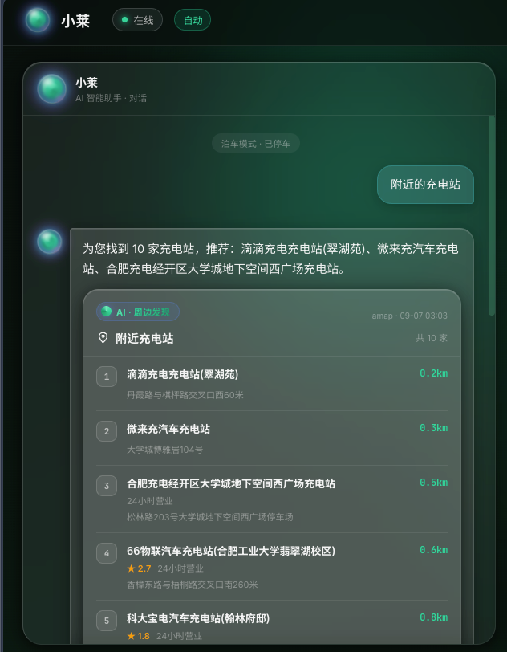
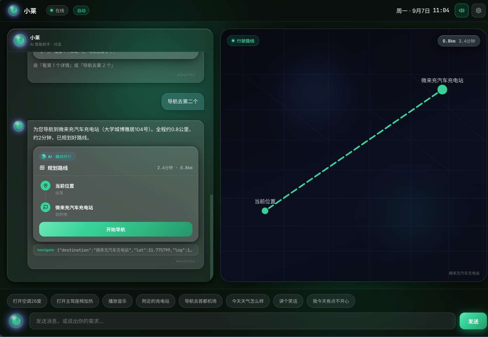
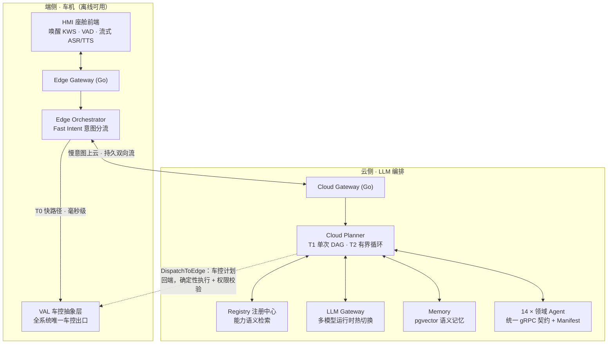
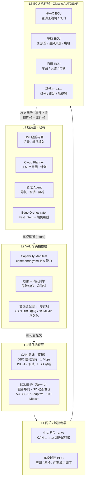

# 智能座舱 Multi-Agent 系统 · Flashpit Agent

> 云边协同的智能座舱 AI Agent 系统。一声「小莱小莱」，从毫秒级车控到多日行程规划、分钟级
> 深度调研，一个语音入口全部完成。**LLM 只负责理解与规划，确定性系统负责执行**——没有任何
> 一条车控指令由 LLM 直接下发。

**14 个领域 Agent · 30 个服务一键起栈 · 68 个车控对象** · 全真实数据源（高德 / 和风 / Exa /
Tushare / api-football）· 端侧快路径毫秒级执行、断网可用 · 服务间 gRPC 契约，Agent 经
Registry 即插即用。

## 能做什么

| 你说 | 系统在做什么 |
|---|---|
| 「空调调到 22 度」 | 端侧快路径毫秒级执行，断网可用，全程零 LLM |
| 「接女儿放学，顺路买杯咖啡，五点前要到学校」 | 关系图谱解析「女儿」的学校 + 真沿途咖啡候选逐家 ETA + 到达时限判定，一轮完成 |
| 「咖啡不买了，先去加油站，别迟到」 | 对**进行中导航**增量改道：删途经点、就近加油站插入，目的地与时限保持不变 |
| 「老婆喜欢吃粤菜」…数天后「晚上找地方和老婆吃饭」 | 长期记忆改变的是**结果集**（直接检回粤菜馆），不是一句「已参考您口味」的话术 |
| 「打开空调，放首林俊杰，导航去公司」 | 混合多意图按语义组分流：本地车控/媒体立即执行，慢意图并行上云，同一请求协同完成 |
| 「导航去那个像春笋的大楼」 | 视觉地标 → LLM 解析官方名 → 高德真实 POI 校验后导航 |
| 「帮我规划周末去杭州的两天行程」 | LLM 提议骨架 + 确定性流水线接地真实 POI + 按真实电量沿路线编织充电站 + 校验每日车程 |
| 「创建钓鱼模式：座椅放平、氛围灯调暗」 | 一句话造场景：LLM 仅创建期编译（过 VAL 词表白名单），激活与执行零 LLM，退出恢复到激活前状态 |
| 「到公司之前提醒我交周报」 | 按导航 ETA 反算提醒时刻，一轮成单，到点主动触达 |
| 「明天第一场比赛提醒我观看」 | 赛事 Agent 与提醒 Agent 跨域交接：开赛前自动提醒 |
| 「哪天下雨就把行程换成室内」 | 按天气预报对既有行程确定性改排 |
| 「深入调研固态电池量产进展，不急，查完告诉我」 | 异步深度调研：秒级受理，后台多视角迭代检索，完成后主动推送带引用的分节报告 |
| 「那个调研查得怎么样了」／「别查了」 | 后台长任务有账本：能问进度、能中途喊停、重启中断后诚实告知而不是假装还在跑 |
| 「（看着刚列出的店）第一家和第二家一共多少钱」 | 候选集是一等会话对象：最值 / 合计 / 序数取值三类聚合在规划**之前**确定性算出，零 LLM——系统持有的事实绝不让模型编 |
| 「你刚才都帮我做了什么」 | 执行过的动作随轮次入账本，审计追问由确定性出口作答并绑定本会话——说做过的就真做过 |

## 界面预览

以下为本地真栈运行的实际截帧（白绿主题 · 助手「小莱」），所有数据均来自真实 Provider，非 mock。

### 周边发现：一句话检索真实 POI

说「附近的充电站」，`nearby-agent` 经高德 POI 2.0 实时检索，返回带距离、地址、评分与营业状态的候选列表；候选集是一等会话对象，可继续说「导航去第 2 个」「第一家和第二家一共多少钱」做序数引用与聚合。



### 路线规划：多轮指代 + 地图联动

承接上一轮候选集，说「导航去第二个」，`navigation-agent` 解析序数指代 → 取目标 POI 经纬度 → 路线规划（距离 / ETA）→ 右侧地图实时渲染虚线航路与起终点标记，底部透出 `navigate` 结构化意图供审计。



## 设计主张

四条不动摇的架构承诺，每一条都有测试固化：

1. **规划与执行分离**——LLM 只产出「意图/计划」，一切车控由确定性 Executor 经 VAL（车控抽象层）
   权限校验后下发，危险动作强制二次确认。智能可以试错，安全不能。
2. **快慢双系统**——高频、确定、安全敏感的指令留在端侧毫秒级响应、断网可用；复杂、跨域、
   多轮的意图上云由 LLM Planner 编排。时延与可用性是架构约束，不是优化目标。
3. **Agent 即插即用**——所有 Agent 实现统一 gRPC 契约 + Manifest 声明（能力 / 权限 / 确定性
   路由兜底 / 卡片优先级），经注册中心发现。**新增一个领域 Agent 不改一行编排核心代码**。
4. **真实优先**——导航/天气/搜索/新闻/赛事/股票全部接真实数据源；外源数据卡片携带 `_prov`
   溯源标记（真实性 / 来源 / 取数时间，HMI 徽章可见）；运行期真实源失败一律**诚实降级说拿
   不到**，绝不回退 mock 假数据。演示可以降级，不能造假。

## 系统架构



服务间同步调用走 gRPC（`proto/` 为唯一契约源），异步与主动推送走 NATS；短期状态 Redis、
长期/向量 PostgreSQL + pgvector。请求按复杂度落入三层运行模型：

| 层 | 处理什么 | 形态 |
|---|---|---|
| **T0 端侧快路径** | 车控/媒体等高频确定性指令 | 规则 + 知识库，毫秒级本地执行，离线可用 |
| **T1 云端单次 DAG** | 复杂 / 跨域 / 多意图请求 | LLM Planner 一次规划，确定性引擎并行执行 |
| **T2 有界 Agentic 循环** | 需按中间结果调整计划的任务 | 迭代次数与时间预算受控，自适应再规划 |

### 语音：全双工交互回路

从唤醒到打断全链路流式，引擎全部可切换：

- **唤醒**：浏览器本地 KWS（sherpa-onnx WASM），预设唤醒词「小莱小莱 / 你好小莱…」，
  唤醒前音频不出浏览器，唤醒后人声应答。
- **听**：silero VAD 端点检测 + DashScope 实时流式 ASR——边说边上屏、停顿定稿自动发送。
- **说**：服务端流式 TTS（文本增量进、PCM 分片出），cosyvoice / qwen3 / MiMo / MiniMax 四引擎
  可切；播报中随时打断（barge-in）。
- **免唤醒连续对话**：续问窗内直接接话；「退下吧」本地退场不上云。
- **拒识与澄清（置信度三段式）**：hands-free 场景下非受话语句静默拒识——不打扰、不落库；
  真歧义句出选择卡问一句再执行，明确句绝不反问。
- **端到端语音直连（可选挡位）**：闲聊与常识由语音大模型直接听直接答；需要执行或查实时
  信息的请求自动交回确定性链——车控没有一条路径绕过权限校验与二次确认。默认关。
- **按声音区分乘员（可选挡位）**：唤醒后首句识别说话人，记忆按乘员隔离（OwnerKey 数据面
  隔离）。认不出时一律按主驾处理。**声纹只用于区分记忆，不作为任何权限或支付的凭证**。
- **看一看（可选挡位）**：说「那是什么 / 这是什么车」时抓一帧当前画面交多模态模型识别；
  只在说这类话时抓，图像只在网关内存里活两分钟，不落盘、不进对话链。

### 端侧：车控与混合多意图

68 个车控/媒体对象（空调 / 座椅 / 车窗 / 氛围灯 / 360 环视 / 蓝牙 / 广播…），知识库驱动
归一化、校验、安全门控与话术；混合多意图按语义组分流，本地动作与云端慢意图在同一请求内
协同执行。

### 云端：14 个领域 Agent

| Agent | 一句话能力 |
|---|---|
| `navigation` | 高德导航：POI 检索、视觉地标/俗称解析、途经点解析、到达时限 ETA 判定、路线偏好、**进行中路线增量改道** |
| `nearby` | 周边发现（高德 POI 2.0）：餐饮/酒店/景点/影院/停车/充电，价位与营业状态筛选 |
| `trip-planner` | 结构化多日行程：真实 POI 接地 + 电量感知充电编织 + 多城市保序 + 局部改排不漂移 |
| `charging-planner` | 充电规划：沿途/目的地充电站、候选二次确认 |
| `info` | 天气（和风）/ 搜索（Exa 接地合成：强制引用、无据弃权）/ 新闻 / 股票（Tushare）/ 赛事（api-football） |
| `deep-research` | 深度调研：多视角子问题 → 有界并行检索 → 带引用分节报告 + 渐进语音简报，支持异步分钟级 |
| `reminder` | 自然语言日程/提醒/待办：改期 / snooze / 重复规则、到点主动触达、跨域交接 |
| `scene-orchestrator` | 用户自定义场景：一句话创建、策略引擎求值、退出真恢复、执行后诚实对账 |
| `road-safety` | 路况安全与响应式主动播报 |
| `parking-payment` | 停车缴费：查费只读、缴费经统一支付网关出扫码付款码（Agent 不持支付凭证） |
| `manual-rag` | 车型车主手册 RAG：整本章节/图文问答，索引绑定私有 `.mrag` 图文包，错车型/低相关 fail-closed |
| `chitchat` | 闲聊与常识直答（墙钟/日期按系统时钟确定性直答，绝不让 LLM 编时刻） |
| `vision` | 看一看：对着窗外问「那是什么」，抓当前画面单帧交多模态模型识别（图像只在网关内存活两分钟） |
| `mcp-bridge` | 受控 MCP 生态桥：**人工准入 + 版本锁定 + schema 指纹**三重锁定；写操作有确认闸、请求指纹幂等、账本落账。已接入麦当劳/瑞幸官方 MCP 复合工作流；系统不代用户最终付款 |

规划知识按需供给（`skills/`）：多日行程、导航顺路、条件依赖、充电分流这类**组合判据**以
声明式文件供给 Planner——词法+语义双通道检索注入，每份知识自带 golden。落域准确率靠**数据**
增长：范例投进 `skills/exemplars/`，检索后作 few-shot 影响 Planner 判断；确定性 `route_hints`
在 LLM 之后硬改写计划，防模型把判对的结果踩掉。

### 记忆、上下文与个性化

- **语义记忆**（pgvector）：自动从对话抽取偏好与个人实体，语义召回注入规划与闲聊；
  隐私分级、可查可删。
- **上下文装配**：统一 token 预算内装配能力目录 + 对话历史 + 长期记忆 + 结构化焦点态
  （跨轮指代不靠啃原文；候选集与执行事实是焦点态的一等成员）。
- **主动性有治理层**：七路主动（routine / 场景触发 / 路况播报 / 提醒到点与到地 / 深调研完成 /
  晨间早报 / 低电量顺路建议）先过**统一主动引擎**——情境断言在投递时刻复核、跨生产方去重、
  驾驶负荷高时攒着说、同窗到达的合并成一条，再经 NATS 到 HMI。

### 多 LLM / 多引擎运行时

- **LLM**：MiMo / MiniMax / DeepSeek / 通义千问进程内注册表，HMI 设置页运行时热切换、
  切换持久化；429 与流式故障分类降级、跨厂商备份档、健康探针；embedding 与 chat 厂商解耦。
- **ASR**：DashScope 实时流式（qwen3 / fun 双协议）；**TTS**：cosyvoice / qwen3（含方言）/
  MiMo / MiniMax 四引擎，「引擎 → 音色」两级选择。

### 可观测

trace_id 从 HMI 气泡角标一键复制，贯通到每一跳 LLM 调用（tokens / 时延 / 门控内容）；
collector SQLite 持久化；Dashboard 四视图——会话三级下钻、总览、日志、badcase 收藏一键
重放对照。Prometheus `/metrics` + OTel span 导出经 `--profile observability` 可选启用。

## 快速开始

依赖：Docker Desktop、Go 1.24+、Node 20+、buf（仅改 proto 时需要）。

```bash
cp .env.example .env         # 不配任何密钥也能跑：LLM 落 MockProvider，外部数据源走 mock
make proto                   # 生成 gRPC 代码（新 clone 首次 / 改 proto 后必跑）
make up                      # 起全栈 30 个服务
```

起栈后：

- **HMI 座舱** <http://localhost:5173> —— 点击/按住「小莱」光球说话，或直接打字。
- **可观测台** <http://localhost:5174> —— 会话下钻、trace、LLM 消耗归属。

注意：

- 只能从根 `compose.yaml` 启动（`make up` 已封装）；直接用 `deploy/docker-compose.yaml`
  启动会丢失根 `.env`，真实 Provider 会静默回退 mock。
- 真实数据源与 LLM 凭证键见 `.env.example`。

## 目录结构

```text
proto/            gRPC 契约——所有接口的唯一真相源
gateway/          Go 接入网关（edge/ 端侧、cloud/ 云侧）
orchestrator/     edge/ 端侧编排 + FastIntent + VAL（PoC 模拟）；cloud/ 云端 LLM Planner
agents/           14 个领域 Agent；_sdk/ 公共 SDK（BaseAgent / 检索与接地内核 / 任务账本）
skills/           Planner 智能供给声明式载体：guides/ 领域组合判据、policies/ 跨域软约束、
                  exemplars/ 落域范例库
llm-gateway/      LLM 多模型网关——LLM / Embedding / ASR / TTS 的唯一出口
registry/         Agent 注册中心（manifest + 能力语义检索）
memory/           记忆 / 画像服务（pgvector）
security/         权限引擎、scope 定义、内容审核、注入防护
payment-gateway/  统一支付网关（Agent 不持支付凭证）
proactive/        统一主动引擎——「该不该现在打扰驾驶员」的唯一裁决点
observability/    NATS 事件出口、collector、trace / 指标
hmi/              React 座舱前端（Aurora Glass）
dashboard/        React 可观测台
runtime/          共享运行时（gRPC keepalive / mTLS / 优雅停机）与端云共用的确定性判定
                  （时区墙钟 / 指令极性 / 中文时间词 / 营业时间 / 安全信号 / 问句形态）
deploy/           docker-compose / 证书生成
docs/             文档（架构与设计说明见各服务 README）
certs/            mTLS 证书生成物（gitignore）
models/           端侧模型与手册索引（gitignore，保留目录结构）
```

## 工程规则

- 接手第一步、红线与自检入口：`AGENTS.md`；
- 工程约定、目录规范、安全红线：`CLAUDE.md`；
- 环境变量速查：`.env.example`。

## 现状与边界

当前为 **Phase 1 工程化 PoC**：T0 / T1 / T2 运行模型、云端中枢、语音回路、记忆/上下文、
可观测与 14 个领域 Agent 均已落地，`make up` 一键起栈即用。距量产的已知边界如实列出：

- **VAL 为 Python 模拟**（`orchestrator/edge/val.py`）：真实 SOME-IP/CAN 对接、车规资源约束
  与 OTA 属量产阶段。
- **单实例状态**：Cloud Gateway 车辆长连状态在单实例内存；Registry 已有 PostgreSQL 持久化
  与周期重注册自愈，多实例扩展待做。
- **安全能力已落地，本地开发档默认关**：两层会话鉴权（`AUTH_REQUIRED`）与服务间 mTLS
  （`GRPC_TLS`）经 env 门控，开启即全栈生效；真实 IdP、证书轮换属后续。
- **商户闭环为 PoC 账号模型**：麦当劳/瑞幸复合工作流已打通到「创建未支付订单、展示受控支付
  入口、查单」，不执行最终付款，麦当劳官方工具面无远程取消；多乘员独立商户账号与 token
  自动刷新未产品化。

## 硬件对接：从 PoC 到量产

当前 VAL 为 Python 模拟（`orchestrator/edge/val.py`），车控指令到达 VAL 后直接返回成功，
不发真实报文。对接硬件的本质是**在 VAL 层增加真实协议后端**，上层 Agent / Planner / HMI
一行不改——这就是「车控只经 VAL」架构红线的价值。

### 全链路架构



### 两条技术路线

| 维度 | CAN 总线（传统车型） | SOME-IP（新一代域控 / 中央计算） |
|---|---|---|
| 通信模型 | 信号导向（Signal-based），广播 | 服务导向（Service-oriented），RPC + PubSub |
| 带宽 | 1 Mbps（CAN FD 5–8 Mbps） | 100 Mbps ~ 1 Gbps（车载以太网） |
| 数据定义 | **DBC 文件**：CAN ID + 字节位 + 缩放因子 + 偏移 | **Fibex / ARXML**：服务接口定义 |
| 服务发现 | 无，静态配置 | SD（Service Discovery）动态发现 |
| 典型 ECU | 座椅 / 空调 / 门窗等车身控制器 | 域控制器 / 座舱 / 智驾域 |
| 实现库 | `python-can` + `cantools` + `python-can-isotp` | `vsomeip`（C++）/ `CommonAPI` / `someip-py` |
| 诊断 | UDS（ISO 14229）over ISO-TP（ISO 15765） | UDS over SOME-IP 或 DoIP |

量产车多为混合架构：座舱域控走 SOME-IP，车身 ECU 仍走 CAN，中间靠中央网关（CGW）
做协议转换。VAL 适配层可能同时支持两种协议，或仅对接座舱域的 SOME-IP 服务、由域控
往下转 CAN。

### VAL 适配层实现

在 `orchestrator/edge/val/` 下新增后端，通过环境变量切换：

```text
orchestrator/edge/val/
├── base.py          # ValBackend 抽象基类：send_command(command) -> result
├── mock.py          # 当前 Mock VAL（保留，用于 CI / 离线开发）
├── can_backend.py   # 真实 CAN 后端：cantools 加载 DBC → 编码信号 → SocketCAN 发送
└── someip_backend.py # 真实 SOME-IP 后端：服务发现 → Method 调用 → Event 订阅
```

`VAL_BACKEND=mock|can|someip` 控制使用哪个后端，切换不影响上层。

### 一条「空调 26 度」指令的完整流程（CAN 路线）

1. HMI / 语音 →「打开空调 26 度」
2. Edge Orchestrator → Fast Intent 识别为 `hvac.set(temp=26)`
3. VAL 权限校验 → `commands.yaml` 确认 `hvac.set` 允许 voice 场景、无需二次确认
4. CAN 后端编码：DBC 查 `HVAC_Control` 帧（如 CAN ID `0x3E2`），信号 `TempSetpoint`
   factor=0.5 → 26° 编码为 raw=52（`0x34`），`PowerOn=1`，组装 data
5. SocketCAN 发送 → `can0` 发出 `0x3E2` 帧
6. HVAC ECU 收到 → 执行 → 通过状态帧（如 `0x3E3`）回传当前温度
7. VAL 监听 `0x3E3` → 解析 `TempActual` → 返回 Orchestrator → HMI 展示「26 度」

关键细节：很多车控指令需要**周期发送看门狗**（如每 100 ms 发一次、持续 1 s），否则 ECU
认为指令丢失而回退；超过 8 字节的数据需 ISO-TP 多帧传输；UDS 诊断需先进入扩展会话
（`0x10 0x03`）→ 安全访问解锁（`0x27`）→ 例程控制（`0x31`）。

### 安全与功能安全

- **权限与确认**：`commands.yaml` 的 `require_confirm` 是危险动作二次确认的权威来源，
  VAL 层强制执行，不信 LLM；`drive` / `voice` 场景限制在 VAL 层判定。
- **总线级安全**：UDS 安全访问（`0x27`）写入关键参数前需密钥解锁；SecOC 给 CAN 报文
  加 CMAC 认证码防伪造；VAL 持续发心跳，ECU 检测丢失进入安全状态。
- **功能安全 ISO 26262**：车控功能按 ASIL 等级划分（刹车 ASIL D，空调 QM）；VAL 需做
  故障检测（发送无响应 / 超时 / 状态与指令不一致 → 上报 + 安全降级）；关键报文加 E2E
  计数器与 CRC 防丢帧错帧。
- **审计**：所有车控指令记录 provenance（发起方 / 时间 / 执行结果），经 `obs` 链路
  持久化，量产时落车端安全存储。

### 验证路径

| 阶段 | 内容 |
|---|---|
| 桌面验证 | Mock VAL → 已有，验证软件链路 |
| HIL 硬件在环 | 真实 CAN 硬件（PCAN-USB / 周立功）+ 真实 ECU 或模拟板；CANoe 抓包验证报文 |
| 台架验证 | 座舱域控 + 车身域控 + 关键 ECU 组台架；SOME-IP 服务联调；全场景回归 |
| 实车验证 | 装测试车，OBD / 诊断口接 CANoe；验证真实执行效果；边界测试（行驶中 / 低电压 / 高温 / 总线高负载） |
| 标定与量产 | 对齐整车 DBC 版本与信号定义；OTA 灰度；功能安全认证（如需要） |

### 立刻可做的准备

1. 确认目标车型通信架构（CAN / SOME-IP / 混合），决定 VAL 后端技术选型。
2. 获取整车 **DBC 或 Fibex 文件**——没有信号定义，一切对接无从谈起。
3. 采购 CAN 适配器（PEAK PCAN-USB FD / 周立功 USBCAN），开发阶段够用。
4. 实现 `can_backend.py` / `someip_backend.py`，`VAL_BACKEND` 环境变量切换。
5. 用 `candump` / CANoe 抓包验证编码正确性与 ECU 响应。
